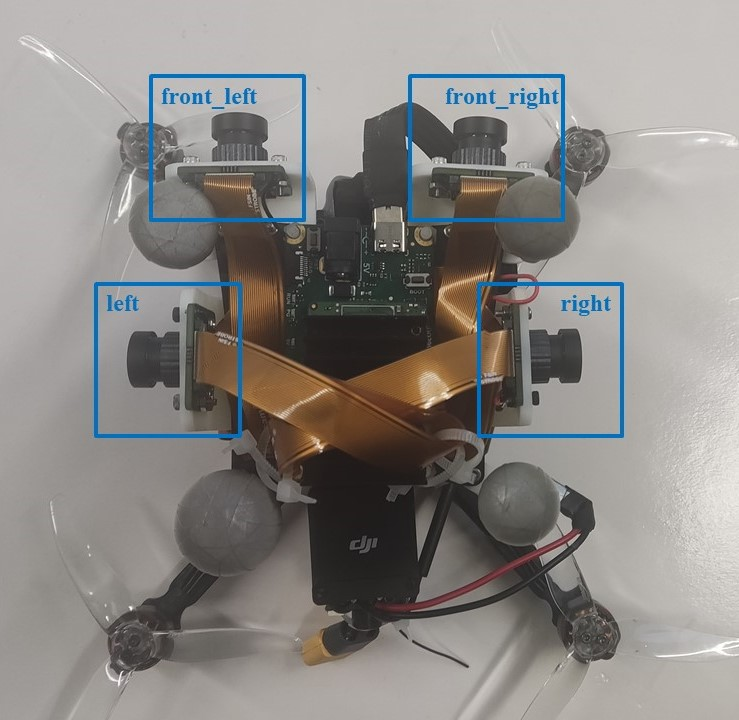

#  无人机智能感知技术竞赛-赛项四-精准定位
### 介绍
[无人飞行器智能感知技术竞赛](https://www.robomaster.com/zh-CN/robo/drone?djifrom=nav_drone)以“智在飞翔”为主题，致力于打造智能感知与控制领域具有全球影响力的技术赛事。竞赛遵循“创新、合作、开放、开源”的指导思想，通过开放、开源和建立竞赛联盟等形式，旨在加速推动智能感知、定位导航与自主控制等领域的技术创新，并积极促进相关创新成果在无人飞行器领域开展转化与应用，发现和挖掘一批优质潜力项目和创新人才，为无人智能产业培养更多的未来技术领军人才。 
在无人飞行器智能感知技术竞赛-赛项四-精准定位中，组委会控制一架真实无人机在室内快速飞行，同时录制一段机载相机采集的多目图像以及机载IMU采集的加速度、角速度数据。参赛队伍从Rosbag数据包中读取所需传感器数据，运行状态估计算法，实现无人机状态估计。参赛队伍需利用组委会提供的传感器数据序列，恢复无人机各个时刻相对起飞位置的位姿。组委会将通过对比无人机轨迹真值（通过动捕系统获得）和队伍提交的轨迹，选出精度较高的参赛队伍。

Figure 1.  Seq3 部分数据

### 竞赛流程与规则
#### 任务
赛前，组委会会公布部分采集到的机载数据传感器数据序列以及通过动捕系统获取到的无人机姿态真值，并且会公布各个传感器的外参和标定数据。参赛学生可以通过公布出来的数据集对自身的定位算法进行验证和调优。线下实体赛中，组委会会公布测评用的机载数据传感器的序列。各参赛队伍下载数据之后，运用自己的算法计算出无人机的位姿和轨迹，并将程序打包成docker上传到服务器，以供评分。
####  评分规则
1.  参赛队将代码封装为docker并上传。组委会在评分时首先启动评分节点和选手提供的roslaunch文件，间隔2s后再播放rosbag；
2.  在 rosbag 播放后，参赛队根据图像、深度与IMU数据，计算输出当前时刻图像帧的位置姿态。注意，输出位姿的时间戳应和当前时刻图像帧的时间戳保持一致，时间戳与图像时间戳不同的位姿数据将被忽略。
3. 	评分节点将接收选手发送的位姿信息，如果该帧位姿的时间戳满足下列两个条件，将被设置为
有效帧，并且记录该帧数据： 
    a. 所填写的时间戳和当前图像的时间戳一致; 
    b. 位姿发布的系统时间晚于当前图像帧发布的系统时间，且小于40ms（要求参赛队在收到图像后的40ms内计算并发布位姿）. 
4.  在 bag包播放完成之后，，评分节点采用记录下来的位姿中前1/3的轨迹与真实轨迹进行对齐；然后将理论真实位姿和对齐后的选手的输出位姿进行对比，通过计算APE的RMSE进行评分：
$$E_{i,j} = (P_{ref,i}^{-1}P_{est,j})\$$
$$\mathrm{RMSE} = \sqrt{ \frac{1}{N} \sum_{\forall ~i,j} E_{i,j}^2 } \$$
5. 	每支参赛队的提交的代码将反复进行5次评分，最终的RMSE成绩为5次评分的最低值；
6.  如果参赛队的APE的RMSE最低值大于5m，那么该参赛队列为A类排名，否则将被列为B类排名。在B类排名中，根据计算RPE的RMSE对参赛队重新排名：
$$E_{i,j} = \delta_{est_{i,j}} \ominus \delta_{ref_{i,j}} = (P_{ref,i}^{-1}P_{ref,j})^{-1} (P_{est,i}^{-1}P_{est,j}) \in \mathrm{SE}(3)\$$
$$\mathrm{RMSE} = \sqrt{ \frac{1}{N} \sum_{\forall ~i,j} E_{i,j}^2 } \$$
关于APE和RPE，可以详细参考：[EVO文档](https://github.com/MichaelGrupp/evo/blob/v1.23.0/notebooks/metrics.py_API_Documentation.ipynb)
#### 排名方式
1.  有效帧和图像总帧数的比值必须大于80%，否则无排名资格；
2.  如果APE 的 RMSE 小于 5m,那么定位轨迹与真值更接近 (APE 的 RMSE越
小) 的队伍排名靠前 (A 类排名)；
3.  如果 APE 的 RMSE 均大于 5m,那么 RPE 的 RMSE 越小的队伍排名靠前(B类排名);
4.  如果 RMSE 差值绝对值小于 0.0001，则有效顿数较多的队伍排名靠前:
5.  若上述条件均无法排出先后，则比较所有有效帧数的平均延时(精确到10us)，平均延时低者排名靠前。

### 评分节点安装教程
1.  cd YOUR_ROS_WORKSPACE/src
2.  git clone （待定）
3.  cd YOUR_ROS_WORKSPACE
4.  catkin build

### 评分节点使用说明
1.  将数据集下载到dataset目录下;
2.  启动位姿估计节点；
3.  在IntelligentUAVChampoinshipStage4目录下打开终端，输入指令：./refree.sh  <sequence_number> <team>， 如：./refree.sh  1 sjtu;
4.  在另一个终端中启动位姿估计节点；
5.  在评分节点终端中输入回车键，开始播放数据；
4.  数据播放结束后，在result/<team>/<seq>目录下查看评分结果。

### 数据集说明
#### 数据下载地址：

seq|大小/GB|百度网盘|谷歌云盘|
:--:|:--:|:--:|:--:|
1|1.5|[提取码：3nxd](https://pan.baidu.com/s/1j-8KskrRKXu-6FXjgo1vlg)|[链接](https://drive.google.com/file/d/1x8rPkdfqzyB9AT_iKdZW0ZrOVaTaui49/view?usp=sharing)|
2|2.0|[提取码：yu9t](https://pan.baidu.com/s/10mrXW0q-36rTbJSXGXpSTQ)|[链接](https://drive.google.com/file/d/156gP97Wccs3C72UQhwSyeJR7CmTuDYAB/view?usp=sharing)|
3|2.6|[提取码：k2zn](https://pan.baidu.com/s/1O5ECYYZAGgDdWcimZReyuQ)|[链接](https://drive.google.com/file/d/14yXoX-YHv3GGccZ9JtAg1aXYgyChrsfH/view?usp=sharing)|

#### 数据说明
用于测试的数据包含3个sequence，三个数据集的特点如下：

seq|速度|快速转向|场景明暗变化|黑暗片段|动态物体|
:--:|:--:|:--:|:--:|:--:|:--:|
1|慢|包含|不包含|不包含|包含|
2|慢|包含|不包含|不包含|包含|
3|较快|包含|包含|不包含|包含|

#### 话题及传感器说明
##### 环视相机
组委会采用OAK FFC4p相机进行数据采集，相机组由四个相机以及一个板载IMU组成，各个相机的名称以及分布如下： 

Figure 2.  相机分布

OAK FFC4p相关话题名称如下：

1.  /oak_ffc/front_left/image，前视左侧相机，像素：680x400，帧率30hz
2.  /oak_ffc/front_right/image，前视右侧相机，像素：680x400，帧率30hz
3.  /oak_ffc/left/image，侧边左视相机，像素：680x400，帧率30hz
4.  /oak_ffc/right/image，侧边右视相机，像素：680x400，帧率30hz
5.  /oak_ffc/imu，板载IMU，帧率100hz
##### 飞控IMU
数据集中包含了飞控IMU信息，帧率230hz，话题名称为/mavros/imu/data

##### 无人机指令信息
(待定，确认要不要发布)

### 真值数据说明
真值由动作捕捉系统捕获得到，以/motion_capture/odom的ros话题形式存储在bag数据集中（正式比赛的bag包不包含该话题）。同时，真值也以tum格式存储在ground_truth目录下。

### 选手输出话题说明
1.  选手的估计结果要以话题名为 /player/odom 的形式实时发送出来，/player/odom 的类型为nav_msgs::Odometry；
2.  请在发布话题时注意，要手动填写header中的时间戳，评分节点只会记录和 /oak_ffc/front_left/image 时间戳一致的/player/odom信息:  

### 标定文件说明
组委会提供了标定结果，以及标定所用的原始rosbag。
#### 标定结果

说明|百度网盘|谷歌云盘|
:--:|:--:|:--:|
飞控IMU-相机内外参结果|[提取码：qmtt](https://pan.baidu.com/s/1g_a2EEymg7jZLqxfTICRnQ)|[链接](https://drive.google.com/drive/folders/1-PBsh7Dq1YBWdkvlD7YUuZhamPmfLDYl?usp=sharing)|
板载IMU-相机内外参结果|[提取码：16ne](https://pan.baidu.com/s/1ZiQ0PJ-deJ6tmqJnF25qpA)|[链接](https://drive.google.com/drive/folders/1-LQGFShkuSb_ylQiElDkwP_dcOR2egFp?usp=sharing)|
IMU标定结果|[提取码：2idj](https://pan.baidu.com/s/15T7JDsTVm56YTILaXCuaQw)|[链接](https://drive.google.com/drive/folders/1-Qwb8bZEX9uUjdjo3jjm7Mywo8_JC0fD?usp=sharing)
内外参标定原始数据|[提取码：4zm1](https://pan.baidu.com/s/1cJj-WcmwjrTcIe4nfuf3Pw)|[链接](https://drive.google.com/drive/folders/1-0DcLUZ4vPFvZcCSN5A6QA4QTSbGLpD3?usp=sharing)|

### 提交说明（待定）
1.  按照 https://github.com/RoboMaster/IntelligentUAVChampionshipBase 中的相关说明将评分节点打包成docker镜像的模式；(待定，重新编写该部分的内容)
2.  将doccker镜像重命名为 学校名称_队名.tar (如 sjtu_visys.tar)的形式并上传.